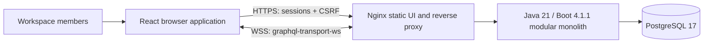
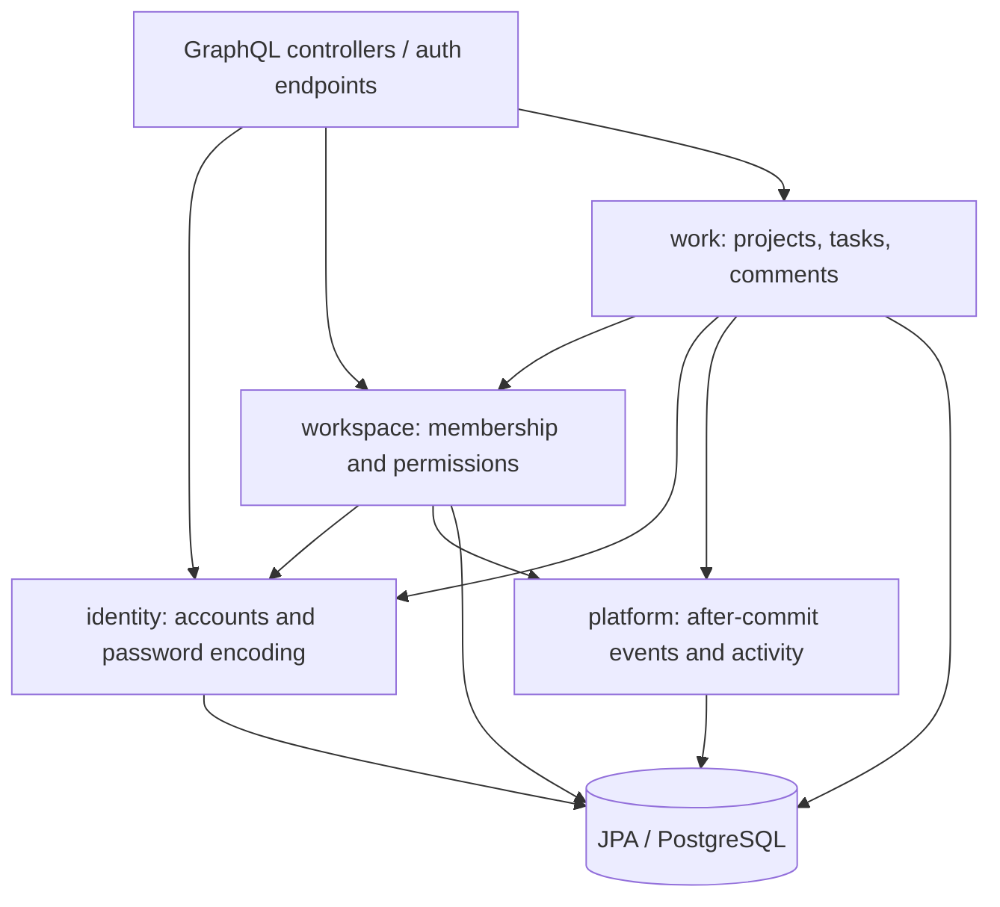
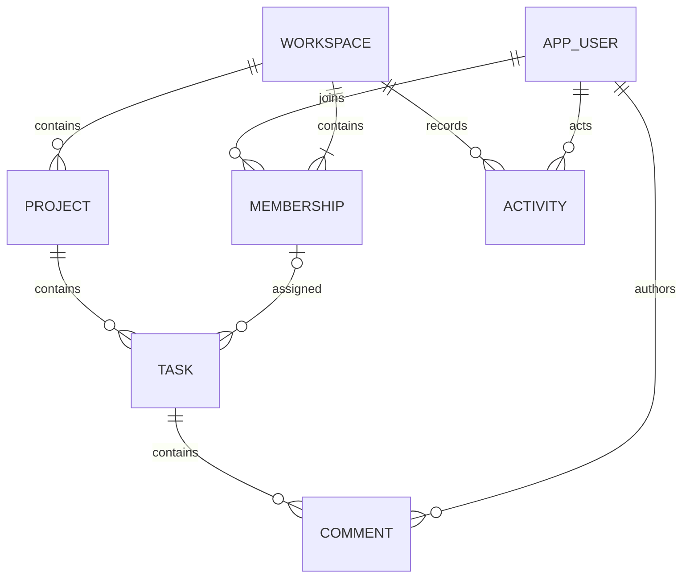
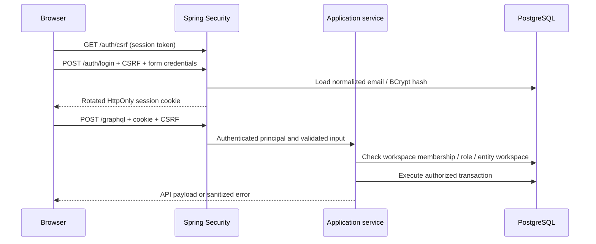

# Architecture

## Context and containers



## Modules and dependency direction



Application services own transactions and permission checks. Controllers adapt validated input records and return API
records; persistence entities are never GraphQL objects. Flat foreign-key identifiers avoid accidental lazy traversal.
User association resolvers and workspace/project nesting batch reads. Tests count SQL for nine workspaces.

## Data model



Foreign keys bind each task to a project/workspace pair and each assignee to a membership in that same workspace. Unique
membership and normalized-email constraints prevent duplicates. Check constraints bound role/status/priority values.
Tasks carry JPA `@Version`, created/updated timestamps, and indexes matching the three sort orders. A workspace row lock
serializes membership and mutation authorization with revocation; this favors correctness at the cost of write
throughput within a busy workspace. Removing a member clears assignments and increments task versions. Deleting tasks
cascades comments but retains activity. Activity/comment IDs include a timestamp prefix plus random tie-breaker;
pagination is stable by ID, including ties within a millisecond.

## Authentication and authorization



No wildcard CORS. HTTP Origin, when supplied, must exactly match `APP_ORIGIN`; WebSocket upgrades require it. Sessions
expire after 30 minutes without HTTP access, and logout invalidates them. Socket operations retain a bounded session
reference, recheck session validity and membership before every event and every two seconds, and terminate on failure.
WebSocket activity does not extend session expiry. Server restarts invalidate sessions.

## Mutation and subscription

```mermaid
sequenceDiagram
    participant A as Browser A
    participant S as Work service
    participant D as PostgreSQL
    participant E as In-process publisher
    participant B as Browser B
    A ->> S: Mutation + expected version
    S ->> D: Membership check, row update, activity insert
    D -->> S: Commit successful
    S ->> E: AFTER_COMMIT change event
    E ->> E: Check B session + current membership
    E -->> B: ID / entity / type / timestamp / version
    B ->> S: Refetch active queries
    S -->> B: Authoritative persisted state
    Note over B, S: On reconnect, refetch again; keep at most 512 event IDs
```

A subscriber has a 128-event buffer; overflow terminates that subscription so reconnect/reload can recover. Transport
has no durable replay, no cross-instance distribution, and no exactly-once guarantee. Clients use bounded exponential
reconnect delay (1–15 seconds with jitter, eight retries) and authoritative refetch rather than optimistic mutation
updates. Editing forms retain a version snapshot to expose conflicts without discarding local edits.

## Capacity and availability

One JVM and one PostgreSQL instance; no capacity benchmark or availability SLA is claimed. Hikari defaults and
serialized workspace writes constrain throughput. Rate limits are per-process, per source IP; sessions and deduplication
are memory-resident. The backend container has a 768 MiB memory limit. Before adding replicas, measure workload,
introduce shared session storage, use a transactional outbox plus shared event distribution, add cross-node rate
limiting and subscription revocation, and keep load-balancer WebSocket affinity/timeout settings aligned. PostgreSQL HA
and backups need their own operational plan.

See ADRs for boundaries, security and event delivery decisions.
